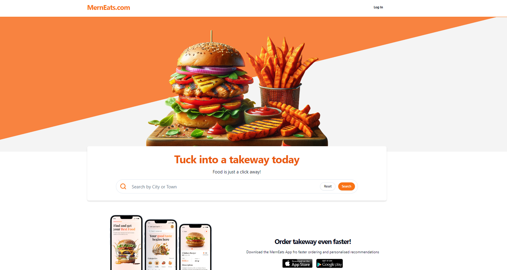
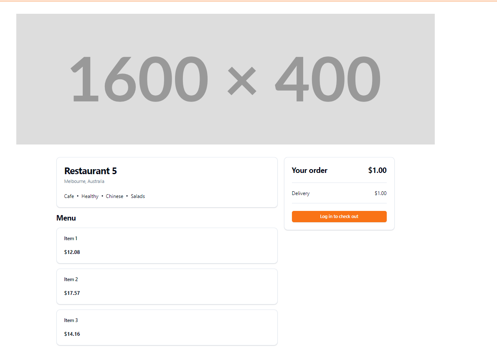
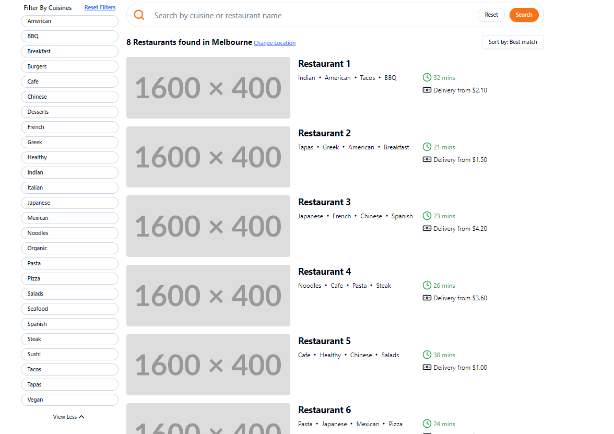

# Food Ordering Full Stack App

# Functionality of this app

user can register through Auth0 and can create restaurant where customers can select items from the menu and can place order. Customers can make payment through strip integration.

# Installation

- to run in locally education purpose
- Download or clone repository of - [MERN Food Ordering app](https://github.com/kartavya99/mern-food-ordering-app)
- NodeJS is required to run the application

# Backend Configuration

Create .env file in Frontend folder root dirt and add following Environment Variables

```
MONGODB_CONNECTION_STRING  - should be from your MONGO DB
AUTH0_AUDIENCE - deployed url for Auth0
AUTH0_ISSUER_BASE_URL - from Auth0
CLOUDINARY_CLOUD_NAME - should be from your cloudinary account
CLOUDINARY_API_KEY - as per above
CLOUDINARY_API_SECRET - as per above
STRIPE_API_KEY - from stripe account
STRIPE_WEBHOOK_SECRET - from stripe account
```

### FrontEnd Configuration

Create .env file in Frontend folder root dirt and add following Environment Variables

```
VITE_API_BASE_URL - backend localhost url
VITE_AUTH0_DOMAIN - from Auth0 account
VITE_AUTH0_CLIENT_ID - as per above
VITE_AUTH0_CALLBACK_URI - as per above
VITE_AUTH0_AUDIENCE - as per above

```

1. Backend

- navigate to the backend directory & run npm install & npm run dev or npm start

2. Frontend

- navigate to the frontend directory & run npm install & npm run dev

# live application

[Food Ordering App](https://mern-food-order-frontend.onrender.com/)

# Below are the sample images of deployed application

## Home Page



## Single Hotel Page



## Hotel Search Page



# Features and Technologies uses

- MongoDB
- Mongoose
- Express.Js
- React.js
- Node.js
- mongoose
- Shadcn-ui
- TypeScript
- Stripe
- React Query
- React-hook-form
- React-router-dom
- multer
- Auth0
- cloudinary
- express-validator
- zod

## Under the MIT license

[](https://opensource.org/licenses/MIT)
